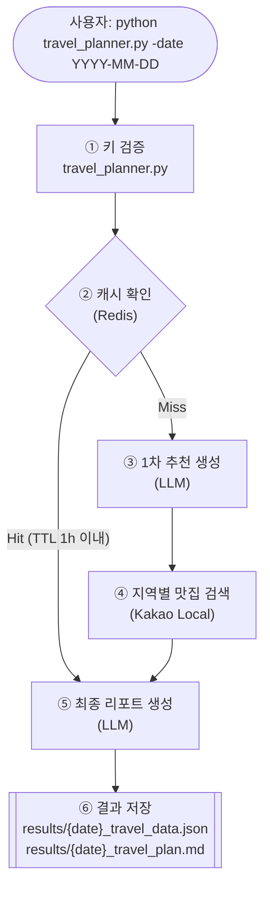
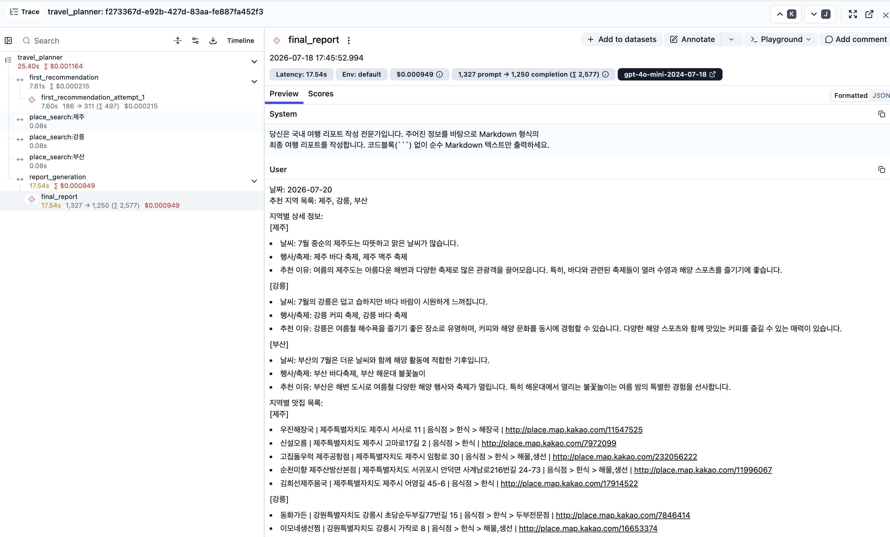
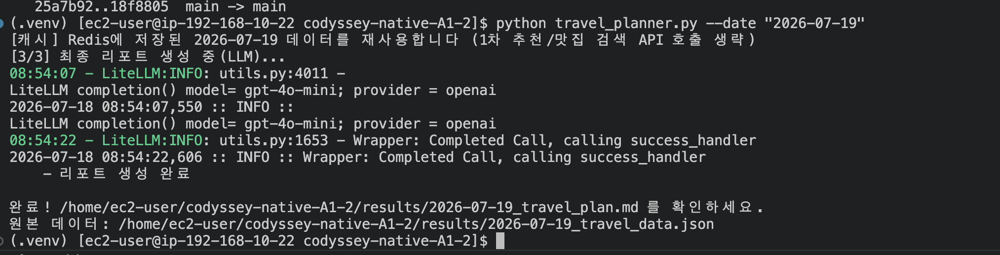

# 국내 여행 추천 프로그램

LLM API(OpenAI, `litellm` 경유)와 지도/장소 검색 API(Kakao Local)를 조합하여, 입력한 날짜를 기준으로 국내 여행지
2~3곳을 추천하고 지역별 맛집을 검색한 뒤 최종 여행 리포트(Markdown)를 생성하는 CLI 프로그램입니다. 모든 LLM 호출은
`litellm`을 통해 이루어지며, [Langfuse](https://langfuse.com)로 트레이싱(trace/span/generation)됩니다. 같은
날짜로 다시 실행하면 로컬 Redis에 저장된 데이터를 재사용해 API 호출을 아낍니다(TTL 1시간).

단일 API 호출이 아니라 **LLM API(1차 추천) → 지도 API(지역별 맛집 검색) → LLM API(최종 리포트)** 순으로 여러
API의 결과를 서로의 입력으로 이어 붙여 하나의 인사이트(여행 리포트)를 만드는 것이 이 프로그램의 핵심입니다.

## 목차

1. [최종 결과물 체크리스트](#1-최종-결과물-체크리스트)
2. [기능 요구사항 대응표](#2-기능-요구사항-대응표)
3. [프로그램 개요 및 프로젝트 구조](#3-프로그램-개요-및-프로젝트-구조)
4. [실행 방법](#4-실행-방법)
5. [API 키 설정 방법](#5-api-키-설정-방법)
6. [결과물 확인 방법](#6-결과물-확인-방법)
7. [에러 처리 정책](#7-에러-처리-정책)
8. [프롬프트 / litellm / Langfuse 트레이싱](#8-프롬프트--litellm--langfuse-트레이싱)
9. [결과 캐싱 (Redis)](#9-결과-캐싱-redis)
10. [과제 목표에 대한 설명](#10-과제-목표에-대한-설명)
11. [보너스 과제 구현 여부](#11-보너스-과제-구현-여부)
12. [개발 환경 / 제약 사항](#12-개발-환경--제약-사항)
13. [제출 시 스크린샷 가이드](#13-제출-시-스크린샷-가이드)

---

## 1. 최종 결과물 체크리스트

| 결과물 | 상태 | 위치 |
|---|---|---|
| CLI 기반 Python 프로그램 (`-date "YYYY-MM-DD"` 필수) | 완료 | [travel_planner.py](travel_planner.py) |
| 진행 로그 + 결과 저장 경로 안내 출력 | 완료 | 실행 시 `[1/3]~[3/3]` 로그, 마지막에 `완료! ... 를 확인하세요.` 출력 |
| 원본 데이터 JSON 1개 이상 (1차 추천 + 맛집 검색 결과 포함) | 완료 | `results/{date}_travel_data.json` |
| 최종 여행 리포트 Markdown 1개 | 완료 | `results/{date}_travel_plan.md` |
| README.md (개요/실행법/키 설정/결과 확인/보안 주의) | 완료 | 이 문서 |

## 2. 기능 요구사항 대응표

| 요구사항 | 상태 | 구현 위치 |
|---|---|---|
| argparse 기반 CLI, 필수 옵션 `-date "YYYY-MM-DD"` | 완료 | [travel_planner.py](travel_planner.py)의 `parse_args()` |
| 날짜 형식 오류 시 사용법 출력 후 종료 | 완료 | `valid_date()` → `argparse.ArgumentTypeError` |
| (추가 검증) 과거 날짜 입력 방지 | 완료 | `valid_date()`에서 `date.today()`와 비교 |
| LLM API 택1 (OpenAI/Gemini 중 택1) | 완료 (OpenAI 선택, `litellm.completion()`으로 호출) | [utils/llm_client.py](utils/llm_client.py) |
| 지도/장소 검색 API 택1 (Kakao/Naver 중 택1, 국내 장소 검색) | 완료 (Kakao Local 키워드 검색 선택) | [utils/connection/kakao_client.py](utils/connection/kakao_client.py) |
| 1차 JSON 최소 스키마 (`recommended_city`/`weather`/`events`/`reason`) | 완료 (보너스 반영, 아래 참고) | `utils/llm_client.py::call_first_recommendation`, 스키마는 [project_config/prompts.yml](project_config/prompts.yml) |
| 맛집 검색 (권장 5곳), 최소 필드(`name`/`address`/`category`/`url`/`x,y`) | 완료 (지역마다 5곳) | `utils/connection/kakao_client.py::search_restaurants` |
| 검색 0건이어도 프로그램 중단 없이 다음 단계 진행 | 완료 | 해당 지역만 `EMPTY_RESULT`로 기록 후 계속 진행 |
| 최종 리포트 Markdown (추천지역/이유/날씨/행사/맛집/1일 일정/오류 요약) | 완료 | `utils/llm_client.py::call_final_report` (LLM 실패 시 `build_fallback_report`가 동일 형식으로 로컬 생성) |
| try-except 기반 에러 처리 | 완료 | 아래 [7. 에러 처리 정책](#7-에러-처리-정책) 참고 |
| API 키 미설정 시 즉시 종료 + 안내 | 완료 | `travel_planner.py::check_required_settings` |
| 지도 API 실패(네트워크/인증/쿼터) 시 "데이터 없음" 처리 후 계속 진행 | 완료 | `kakao_client.py`의 상태코드별 분기 |
| LLM JSON 파싱 실패 시 최대 1회 재시도(무한 재시도 금지) | 완료 | `call_first_recommendation`의 `for attempt in range(2)` |
| 오류 목록 내부 관리 (`errors`, 빈 리스트 허용) | 완료 | 전 단계에서 공유되는 `errors: list` |
| API 키를 코드에 직접 작성하지 않음 (.env/환경변수) | 완료 | [project_config/settings.py](project_config/settings.py) (pydantic-settings) |
| `results/` 폴더 생성 및 날짜 기준 파일 저장 | 완료 | `travel_planner.py::save_results` |

> 보너스 과제(복수 지역 추천)를 기본 동작에 반영하면서, 1차 JSON의 최상위 키가 `recommended_city`(단일
> 문자열)에서 `recommended_cities`(지역별 상세 배열)로 확장되었습니다. 배열의 각 항목이 `city`/`weather`/
> `events`/`reason` 키를 가지므로, 과제 스펙이 요구하는 4개 필드는 지역 단위로 여전히 그대로 충족됩니다.
> 자세한 내용은 [11. 보너스 과제 구현 여부](#11-보너스-과제-구현-여부) 참고.

## 3. 프로그램 개요 및 프로젝트 구조

여행 날짜(`-date`)를 입력하면 다음 순서로 동작합니다.

1. **1차 추천 (LLM)**: 입력한 날짜를 기준으로 여행하기 좋은 국내 도시 2~3곳을, 각각의 날씨 요약/행사·축제/
   추천 이유와 함께 JSON 배열로 생성합니다.
2. **맛집 검색 (Kakao Local)**: 추천된 지역마다 맛집을 최대 5곳씩 검색합니다. 특정 지역의 검색 결과가 없거나
   API 호출이 실패해도 프로그램은 중단되지 않고 그 지역만 "데이터 없음"으로 표기한 뒤 다음 단계로 진행합니다.
3. **최종 리포트 생성 (LLM)**: 지역별 추천 정보와 맛집 목록을 종합하여, 지역별로 정리된 Markdown 최종
   여행 리포트를 생성합니다.

같은 `-date`로 1시간 이내에 다시 실행하면, Redis에 캐시된 1차 추천/맛집 데이터를 그대로 사용해 1·2단계의
API 호출을 생략합니다. 자세한 내용은 [9. 결과 캐싱 (Redis)](#9-결과-캐싱-redis) 참고.

실행 결과는 `results/` 폴더에 저장됩니다.

- `results/{date}_travel_data.json`: 1차 추천 JSON, 지역별 맛집 검색 결과, 오류 요약(`errors`)을 포함한 원본 데이터
- `results/{date}_travel_plan.md`: 최종 여행 리포트 (Markdown)

### 프로젝트 구조

```
travel_planner.py                        # CLI 엔트리포인트 (argparse + 전체 흐름 오케스트레이션)
project_config/
  settings.py                            # pydantic-settings 기반 환경변수/설정
  prompts.yml                            # LLM 프롬프트 텍스트 (코드와 분리)
utils/
  prompt.py                              # prompts.yml 로더 + 변수 치환
  llm_client.py                          # litellm 호출 + Langfuse generation 기록 + 폴백 리포트
  connection/
    kakao_client.py                      # Kakao Local 맛집 검색 클라이언트
    langfuse_manager.py                  # Langfuse 클라이언트 싱글톤 (미설정/장애 시 NoOp)
    redis_cache.py                       # Redis 캐시 클라이언트 싱글톤 (TTL 1시간, 장애 시 캐시 미스로 처리)
```

### 아키텍처 / 플로우



- **litellm**: OpenAI 직접 SDK 대신 `litellm.completion()`을 통해 1차 추천(③)과 최종 리포트(⑤) 두 LLM 호출을 모두 수행합니다.
- **Langfuse**: 실행마다 trace/span/generation이 기록되어 각 단계를 추적할 수 있습니다(다이어그램에는 생략). 키 미설정 시 NoOp으로 대체되어 흐름에는 영향이 없습니다. 자세한 내용은 [8. 프롬프트 / litellm / Langfuse 트레이싱](#8-프롬프트--litellm--langfuse-트레이싱) 참고.
- **Redis**: 캐시 히트 시 ③·④ 단계를 건너뛰고 바로 ⑤(최종 리포트 생성)로 이동합니다. 캐시는 1차 추천이 성공했을 때만 TTL 3600초로 저장됩니다. 자세한 내용은 [9. 결과 캐싱 (Redis)](#9-결과-캐싱-redis) 참고.

## 4. 실행 방법

### 4-1. 의존성 설치

```bash
python3 -m venv .venv
source .venv/bin/activate   # Windows: .venv\Scripts\activate
pip install -r requirements.txt
```

결과 캐싱 기능을 쓰려면 로컬에 Redis 서버가 실행 중이어야 합니다(기본 `localhost:6379`). 자세한 내용은
[9. 결과 캐싱 (Redis)](#9-결과-캐싱-redis) 참고.

### 4-2. API 키 설정

아래 "5. API 키 설정 방법"을 먼저 진행하세요.

### 4-3. 실행

```bash
python travel_planner.py --date "2026-03-15"
# 또는
python travel_planner.py -date "2026-03-15"
```

날짜 형식(`YYYY-MM-DD`)이 올바르지 않거나, 오늘보다 과거 날짜이면 사용법 안내를 출력하고 종료합니다.

첫 실행(캐시 미스) 예시:

```
[1/3] 1차 추천 생성 중(LLM)...
    - recommended_cities: "제주, 강릉"
[2/3] 맛집 검색 중(지도/장소 API)...
    - [제주] 맛집 5곳 검색 완료
    - [강릉] 맛집 5곳 검색 완료
[3/3] 최종 리포트 생성 중(LLM)...
    - 리포트 생성 완료

완료! results/2026-03-15_travel_plan.md 를 확인하세요.
원본 데이터: results/2026-03-15_travel_data.json
```

같은 날짜로 1시간 이내에 재실행한 경우(캐시 히트) 예시:

```
[캐시] Redis에 저장된 2026-03-15 데이터를 재사용합니다 (1차 추천/맛집 검색 API 호출 생략)
[3/3] 최종 리포트 생성 중(LLM)...
    - 리포트 생성 완료

완료! results/2026-03-15_travel_plan.md 를 확인하세요.
원본 데이터: results/2026-03-15_travel_data.json
```

검색 결과 0건, 인증 실패(401/403) 등 실패 케이스에서의 로그 예시는 [7. 에러 처리 정책](#7-에러-처리-정책)을 참고하세요.

## 5. API 키 설정 방법

이 프로그램은 아래 환경변수가 필요합니다. `OPENAI_API_KEY`/`KAKAO_REST_API_KEY`는 필수이며, `LANGFUSE_*`와
`REDIS_*`/`CACHE_TTL_SECONDS`는 각각 트레이싱/캐싱 기능을 쓰려면 필요합니다(미설정 시 해당 기능만 자동으로
비활성화되고 프로그램 본체는 정상 동작합니다).

| 환경변수 | 설명 | 발급처 |
|---|---|---|
| `OPENAI_API_KEY` | OpenAI API 키 (`litellm`을 통해 호출) | https://platform.openai.com/api-keys |
| `KAKAO_REST_API_KEY` | Kakao Local(장소 검색) REST API 키 | https://developers.kakao.com (내 애플리케이션 > REST API 키, "카카오맵" 제품 활성화 필요) |
| `OPENAI_MODEL` (선택) | 사용할 OpenAI 모델. 미설정 시 `gpt-4o-mini` 사용 | - |
| `LANGFUSE_HOST` (선택) | Langfuse 서버 주소. 미설정 시 사내 인스턴스(`http://192.168.10.20:3000`) 사용 | 사내 Langfuse |
| `LANGFUSE_PUBLIC_KEY` / `LANGFUSE_SECRET_KEY` (선택) | Langfuse 프로젝트 API 키 | Langfuse 웹 콘솔 > Settings > API Keys |
| `REDIS_HOST` / `REDIS_PORT` / `REDIS_DB` (선택) | 결과 캐싱에 사용할 로컬 Redis 서버 주소. 미설정 시 `localhost:6379`, db `0` 사용 | 별도 발급 없음 (로컬에 Redis 서버 실행 필요) |
| `CACHE_TTL_SECONDS` (선택) | 캐시 유효 시간(초). 미설정 시 `3600`(1시간) | - |

### 방법 A. `.env` 파일 사용 (권장)

프로젝트 루트에 `.env.example`을 복사해 `.env` 파일을 만들고, 실제 발급받은 키 값으로 채워 넣습니다.

```bash
cp .env.example .env
```

`.env` 파일 내용 예시 (실제 키 값은 본인 것으로 교체):

```
OPENAI_API_KEY=sk-...
KAKAO_REST_API_KEY=...
LANGFUSE_PUBLIC_KEY=pk-lf-...
LANGFUSE_SECRET_KEY=sk-lf-...
```

`python-dotenv`와 `pydantic-settings`가 실행 시 `.env` 파일을 자동으로 읽어 환경변수로 등록합니다. `.env` 파일은
`.gitignore`에 등록되어 있어 git에 커밋되지 않습니다.

### 방법 B. 환경변수 직접 설정

macOS/Linux (현재 터미널 세션에만 적용):

```bash
export OPENAI_API_KEY="YOUR_KEY"
export KAKAO_REST_API_KEY="YOUR_KEY"
```

Windows PowerShell (현재 세션에만 적용):

```powershell
$env:OPENAI_API_KEY="YOUR_KEY"
$env:KAKAO_REST_API_KEY="YOUR_KEY"
```

`OPENAI_API_KEY`/`KAKAO_REST_API_KEY` 중 하나라도 설정되어 있지 않으면 프로그램은 API를 호출하지 않고 즉시
종료하며, 위 설정 방법을 화면에 안내합니다. `LANGFUSE_PUBLIC_KEY`/`LANGFUSE_SECRET_KEY`가 없으면 트레이싱은
자동으로 NoOp(아무 동작도 하지 않음) 처리되어 프로그램 실행에는 영향을 주지 않습니다. Redis에 연결할 수 없는
경우도 마찬가지로 캐싱만 건너뛰고 프로그램은 정상 동작합니다.

### API 키 유출 주의 사항

- **API 키(OpenAI/Kakao/Langfuse 모두 포함)를 코드에 직접 작성하지 마세요.** 반드시 `.env` 또는 환경변수로만
  관리합니다. (`project_config/settings.py`가 유일하게 환경변수를 읽는 지점이며, 여기에도 키 값은 하드코딩하지
  않습니다.)
- `.env` 파일은 절대 커밋/공유/제출하지 않습니다. (`.gitignore`에 이미 등록되어 있습니다. git 저장소를 쓰는
  경우, `git status`로 `.env`가 커밋 대상에 포함되지 않았는지 항상 확인하세요.)
- `README.md`, 커밋 메시지, 로그, 결과 파일(`results/` 내 JSON/Markdown) 어디에도 실제 키 값이 남지 않도록
  주의하세요. 본 프로그램은 키 값을 결과물에 출력하지 않으며, Langfuse에 전송되는 trace에도 프롬프트/응답
  내용만 담기고 API 키 자체는 포함되지 않습니다.
- 키가 실수로 노출되었다면 즉시 발급처(OpenAI/Kakao Developers/Langfuse)에서 키를 폐기하고 재발급하세요.
- 키가 유출되면 과금/쿼터 초과 등의 사고로 이어질 수 있으니, 특히 공개 저장소에 push하기 전 `git status`로
  `.env`가 포함되지 않았는지 항상 확인하세요.

## 6. 결과물 확인 방법

실행이 끝나면 `results/` 폴더에 아래 두 파일이 생성됩니다. (파일명의 `{date}`는 입력한 `-date` 값입니다.)

- **`{date}_travel_data.json`**: 아래 구조를 가진 원본 데이터
  ```json
  {
    "date": "2026-03-15",
    "recommended": {
      "recommended_cities": [
        { "city": "...", "weather": "...", "events": ["..."], "reason": "..." }
      ]
    },
    "restaurants_by_city": [
      {
        "city": "...",
        "restaurants": [
          { "name": "...", "address": "...", "category": "...", "url": "...", "x": 0.0, "y": 0.0 }
        ]
      }
    ],
    "errors": [ { "step": "...", "type": "...", "message": "..." } ]
  }
  ```
- **`{date}_travel_plan.md`**: 아래 섹션을 포함하는 최종 Markdown 리포트
  ```
  # {date} 국내 여행 추천 리포트
  ## 추천 지역
  ## 지역별 상세
  ### {지역명 1}
  #### 추천 이유
  #### 날씨 요약
  #### 행사/축제
  #### 맛집 추천        (0건이면 "데이터 없음"으로 표기)
  #### 1일 일정 제안     (오전/오후/저녁)
  ### {지역명 2}
  (지역마다 위 하위 섹션을 반복)
  ## 오류 요약(errors)   (없으면 "오류 없음")
  ```

## 7. 에러 처리 정책

- **API 키 미설정**: 즉시 종료하고 설정 방법을 안내합니다. (`check_required_settings`)
- **지도/장소 API 실패** (네트워크/인증/쿼터/결과 0건): 실패한 지역만 맛집 섹션을 "데이터 없음"으로 처리하고,
  나머지 지역 검색과 리포트 생성은 계속 진행합니다. (`utils/connection/kakao_client.py`)
- **LLM JSON 파싱 실패**: 필수 키만 다시 출력하도록 프롬프트를 수정해 최대 1회 재시도합니다. 그래도 실패하면
  기본값으로 대체합니다. (`utils/llm_client.py::call_first_recommendation`)
- **최종 리포트 생성(LLM) 실패**: 이미 확보한 데이터로 로컬에서 리포트를 조립하여 결과 파일이 항상 생성되도록
  합니다. (`utils/llm_client.py::build_fallback_report`)
- 모든 오류는 내부 `errors` 리스트에 `{step, type, message}` 형태로 누적되며, 원본 JSON과 최종 리포트의
  "오류 요약(errors)" 섹션에 함께 기록됩니다. 오류가 없으면 빈 리스트로 저장됩니다.

오류 타입(`type`)은 아래처럼 분류됩니다.

| type | 의미 | 발생 위치 |
|---|---|---|
| `AUTH_ERROR` | 인증 실패 (401/403) | LLM 호출, Kakao 검색 |
| `QUOTA_ERROR` | 쿼터/속도 제한 초과 (429) | LLM 호출, Kakao 검색 |
| `NETWORK_ERROR` | 네트워크/연결/타임아웃 오류 | LLM 호출, Kakao 검색 |
| `PARSE_ERROR` | JSON 파싱 실패, 빈 응답 등 | 1차 추천 JSON, 최종 리포트 |
| `EMPTY_RESULT` | 검색 결과 0건 | Kakao 검색 |
| `UNKNOWN_ERROR` | 위에 해당하지 않는 기타 오류 | 공통 |

지역이 여러 곳이므로, `place_search` 관련 오류는 지역마다 개별적으로 `errors`에 쌓일 수 있습니다.

인증 실패(401/403) 예시 로그:

```
[2/3] 맛집 검색 중(지도/장소 API)...
    - [제주] 오류: 인증 실패. 키 설정을 확인하세요. '데이터 없음'으로 처리합니다.
    - [강릉] 맛집 5곳 검색 완료
```

검색 결과 0건 예시 로그:

```
[2/3] 맛집 검색 중(지도/장소 API)...
    - [제주] 검색 결과 0건(다음 단계로 진행)
```

## 8. 프롬프트 / litellm / Langfuse 트레이싱

- **프롬프트 분리**: LLM에 보내는 프롬프트 텍스트는 코드에서 분리되어 [project_config/prompts.yml](project_config/prompts.yml)에
  있습니다. 프롬프트 문구나 JSON 스키마 설명을 바꾸고 싶다면 이 파일만 수정하면 되며, 코드(`utils/prompt.py`,
  `utils/llm_client.py`)는 수정할 필요가 없습니다. 실행 중에도 파일 수정 시각(mtime)을 감지해 다음 호출부터
  자동으로 반영됩니다.
- **litellm**: OpenAI 직접 SDK 호출 대신 `litellm.completion()`을 통해 LLM을 호출합니다. 이렇게 하면 이후
  다른 provider(Gemini 등)로 교체하고 싶을 때 `OPENAI_MODEL` 값과 API 키만 바꾸면 되고, 코드/에러 처리 로직은
  그대로 재사용할 수 있습니다.
- **Langfuse 트레이싱**: 실행마다 `travel_planner`라는 이름의 trace가 생성되고, 그 아래
  `first_recommendation` → `place_search:{city}`(추천된 지역 수만큼 생성) → `report_generation` 순서의
  span, 그리고 각 LLM 호출에 대응하는 generation이 기록됩니다. 캐시 히트로 1·2단계를 건너뛴 경우에는 그
  구간의 span 자체가 생성되지 않고, trace 메타데이터에 `cache_hit: true`가 기록됩니다. 트레이싱 확인 방법:
  1. `.env`에 `LANGFUSE_PUBLIC_KEY`, `LANGFUSE_SECRET_KEY`를 설정합니다. (`LANGFUSE_HOST`는 기본값이 사내
     인스턴스 `http://192.168.10.20:3000`으로 지정되어 있어 별도 설정 없이도 동작합니다.)
  2. 프로그램을 실행합니다.
  3. 브라우저에서 `http://192.168.10.20:3000`에 접속해 프로젝트를 선택하면 trace/span/generation을 확인할
     수 있습니다.
  - 키를 설정하지 않으면 [utils/connection/langfuse_manager.py](utils/connection/langfuse_manager.py)의
    NoOp 클라이언트가 대신 사용되어, 트레이싱 없이도 프로그램은 동일하게 동작합니다.

## 9. 결과 캐싱 (Redis)

같은 `-date`로 1시간 이내에 재실행할 때, 1차 추천(LLM)과 지역별 맛집 검색(Kakao) API 호출을 건너뛰고
캐시된 데이터로 리포트만 다시 생성해서 외부 API 비용/속도를 아끼는 기능입니다.

- **저장소**: 로컬에서 실행 중인 Redis (기본 `localhost:6379`, db `0`). 구현은
  [utils/connection/redis_cache.py](utils/connection/redis_cache.py)의 `RedisCacheManager`.
- **캐시 키**: `travel_planner:cache:{date}` (예: `travel_planner:cache:2026-03-15`)
- **TTL**: 3600초(1시간). `CACHE_TTL_SECONDS` 환경변수로 조절할 수 있습니다.
- **캐시에 저장되는 내용**: 1차 추천 JSON(`recommended`)과 지역별 맛집 검색 결과(`restaurants_by_city`)만
  캐싱합니다. 최종 리포트(Markdown)는 캐시 여부와 관계없이 매번 새로 생성합니다.
- **캐시 적용 조건**: 1차 추천이 정상적으로 성공했을 때만 캐시에 저장합니다. LLM 호출이 실패해 기본값
  ("정보 없음")으로 대체된 결과는 캐싱하지 않으므로, 다음 실행에서 다시 정상 호출을 시도합니다.
- **Redis 장애/미기동 시**: 캐시 조회/저장이 실패해도 프로그램은 캐시 없이(즉, 매번 API를 호출하며) 정상
  동작합니다. 실패 사실은 경고 로그로만 남습니다.
- **직접 확인하는 방법** (Redis CLI가 있다면):
  ```bash
  redis-cli -h localhost -p 6379 GET travel_planner:cache:2026-03-15
  redis-cli -h localhost -p 6379 TTL travel_planner:cache:2026-03-15   # 남은 유효 시간(초)
  ```

## 10. 과제 목표에 대한 설명

과제에서 요구하는 4가지 학습 목표에 대해, 이 프로그램의 어느 부분이 그 개념을 보여주는지 정리합니다.

1. **REST API의 요청/응답 구조와 GET/POST 차이**
   - Kakao Local 검색(`utils/connection/kakao_client.py`)은 **GET** 요청입니다. 조회만 하고 서버 상태를
     변경하지 않으므로 쿼리 파라미터(`query`, `size`, `category_group_code`)로 조건을 전달하고, 응답은 JSON
     바디(`documents` 배열)로 받습니다.
   - LLM 호출(`litellm.completion()` 내부적으로 OpenAI Chat Completions API 호출)은 **POST** 요청입니다.
     프롬프트(`messages`)처럼 크고 구조화된 데이터를 매번 새로 "생성"해야 하므로 요청 바디에 JSON을 실어
     보내고, 응답도 JSON 바디로 받습니다.
2. **LLM 출력(JSON)을 다음 단계 입력으로 활용하는 흐름**
   - 1차 추천 LLM 호출 결과(JSON)의 `recommended_cities` 배열에서 각 항목의 `city` 값이 그대로 지역별 Kakao
     검색의 키워드(`{city} 맛집`)로 쓰이고(`travel_planner.py::main`), 그 결과(지역별 맛집 리스트)와 1차
     추천 JSON이 다시 최종 리포트 LLM 호출의 입력으로 합쳐집니다(`utils/prompt.py::build_final_report_messages`).
     즉 "LLM → 구조화 JSON → 다음 API의 입력(지역마다 반복) → 다시 LLM"으로 이어지는 파이프라인입니다.
3. **대표 오류(인증/쿼터/네트워크/파싱)와 대응 원칙**
   - 위 [7. 에러 처리 정책](#7-에러-처리-정책)의 오류 타입 표와 동일합니다. 원칙은 "치명적이지 않은 오류는
     (지역 단위로) 프로그램을 멈추지 않고 다음 단계로 진행하되, 무엇이 실패했는지는 반드시 `errors`에 기록해
     결과물에서 확인 가능하게 한다"입니다. 유일하게 프로그램을 즉시 종료시키는 오류는 API 키 미설정뿐입니다.
4. **API 키를 코드가 아닌 .env/환경변수로 관리하는 이유**
   - 코드/저장소에 키가 남으면 협업·공유 중 실수로 유출될 수 있고, 키를 교체할 때마다 코드를 수정/재배포해야
     하며, 과금·쿼터가 걸린 서비스에서는 유출 시 바로 비용 사고로 이어집니다. 이 프로그램은
     `project_config/settings.py` 한 곳에서만 환경변수를 읽고, 그 외 어떤 파일에도 키를 하드코딩하지 않습니다.

## 11. 보너스 과제 구현 여부

두 보너스 과제 모두 구현했습니다.

| 보너스 과제 | 구현 여부 | 설명 |
|---|---|---|
| 복수 지역 추천 (`recommended_cities` 배열) | 구현 완료 | 1차 추천이 2~3개 지역을 배열로 반환하고(`city`/`weather`/`events`/`reason` 항목별 상세 포함), 지역마다 맛집을 검색해 최종 리포트에 지역별 섹션(`### 지역명`)으로 정리합니다. |
| 결과 캐싱 (Redis, TTL 1시간) | 구현 완료 | 과제 설명은 "저장된 JSON 파일 존재 여부"로 캐시를 판단하는 방식을 예로 들었지만, 이 구현은 로컬 파일 대신 TTL이 있는 Redis를 사용했습니다. 날짜를 키로 1차 추천/맛집 데이터를 캐싱하고, 1시간이 지나면 자동으로 만료되어 다음 실행 시 최신 데이터로 다시 채워집니다. 자세한 내용은 [9. 결과 캐싱 (Redis)](#9-결과-캐싱-redis) 참고. |

## 12. 개발 환경 / 제약 사항

- Python 3.10 이상, 터미널에서 실행 (웹 UI 없음)
- API 키(OpenAI/Kakao/Langfuse)는 코드/README/결과물 어디에도 직접 작성하지 않고 `.env`/환경변수로만 관리
- 결과 캐싱 기능을 쓰려면 로컬에 Redis 서버가 실행 중이어야 합니다(기본 `localhost:6379`). Redis가 없어도
  프로그램은 정상 동작하며, 캐싱만 비활성화됩니다.
- 지도/장소 API 실패 시에도 리포트 생성은 계속 진행 (해당 지역만 맛집 = 데이터 없음)
- LLM JSON 파싱 실패 시 재시도는 최대 1회만 허용 (무한 재시도 금지)

## 13. 작업 결과물 스크린샷 

1. **Langfuse 트레이스 화면**: 

   

2. **redis 확인**:

   

   
